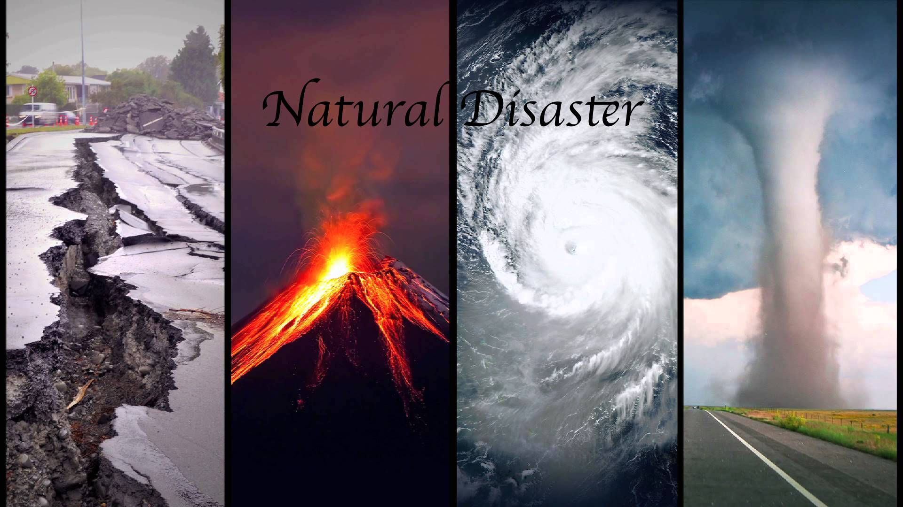

# Project 2: Natural Disaster Navigator: https://bruceyanghy.shinyapps.io/Navigator/

### [Project Description](doc/project2_desc.md)



## Data (ftp://ftp.ncdc.noaa.gov/pub/data/swdi/stormevents/csvfiles/) 

The **learning goals** for this project is:

- business intelligence for data science
- data cleaning
- data visualization
- systems development/design life cycle
- shiny app/shiny server


## Project Title: Natural Disaster Navigator
Term: Fall 2017


+ **Project summary**: Natural disasters have been a prominent fixture in this year’s news. From Hurricane Harvey to wildfires in California, each causing casualties, millions or even billions of dollars in damages. What wisdom and insight can we draw from past data to help us make informed decisions, minimize casualties and damages? We present to you our Natural Disaster Navigator, an RShiny App we built based on our belief that is not only of business value but also societal value to understand and extract insights from natural disaster data in order to minimize costs and optimize allocation of government resources in the face of natural disasters.

Following [suggestions](http://nicercode.github.io/blog/2013-04-05-projects/) by [RICH FITZJOHN](http://nicercode.github.io/about/#Team) (@richfitz). This folder is orgarnized as follows.

```
proj/
├── app/
├── lib/
├── data/
├── doc/
└── output/
```

Please see each subfolder for a README file.

---
Objective: Commodity Pricing Analysis and Prediction

OIL
COFFEE
NATURAL GAS
GOLD
WHEAT
COTTON
SUGAR
SILVER
COPPER

